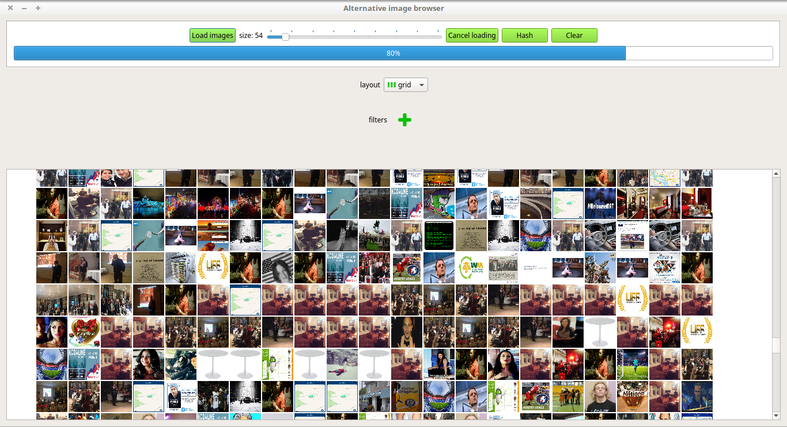
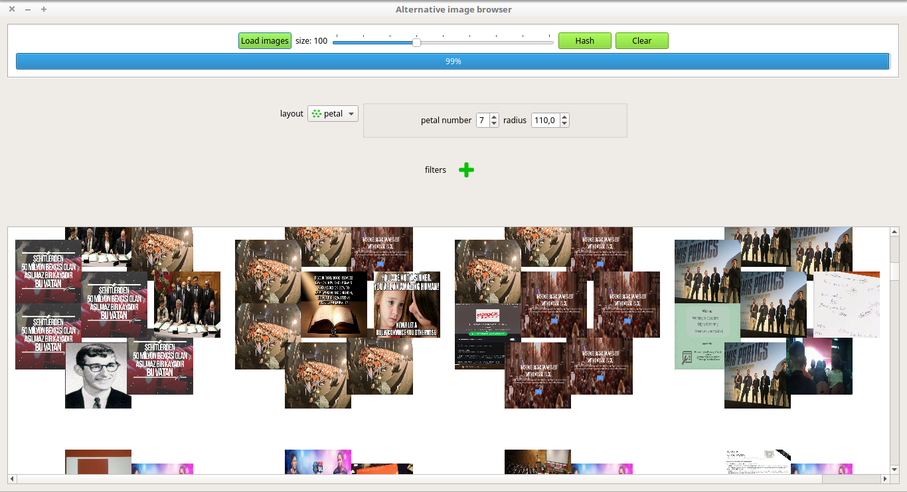
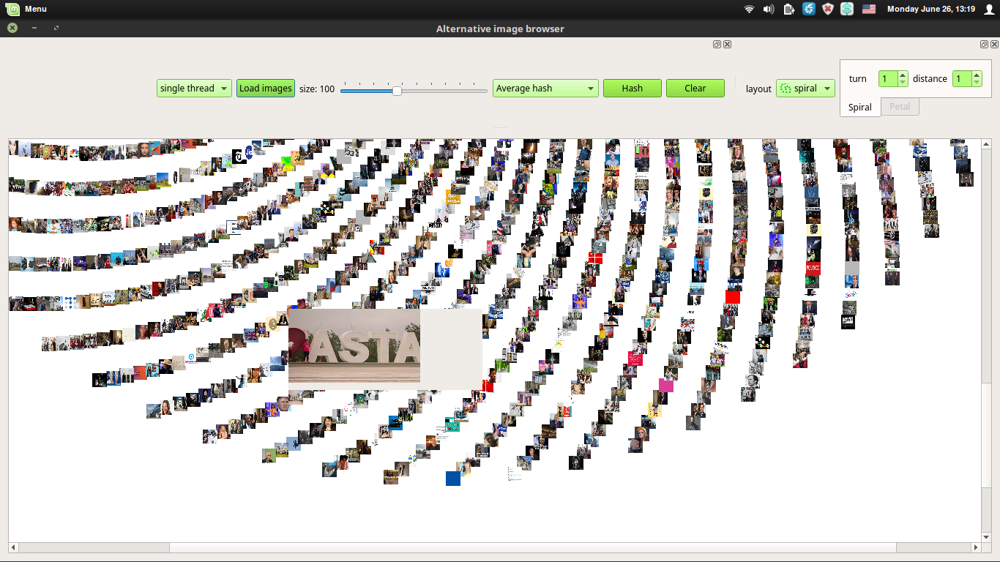
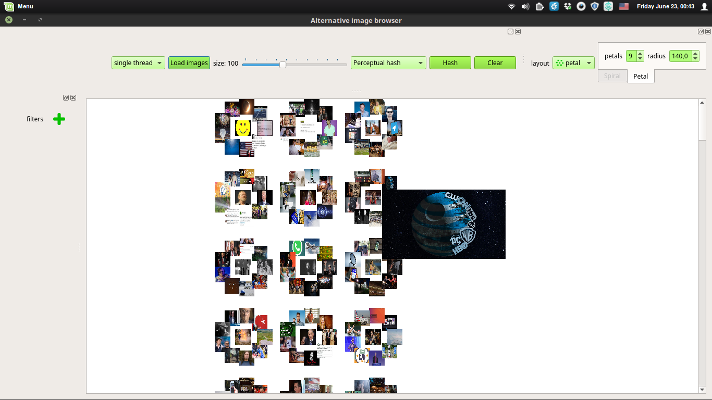
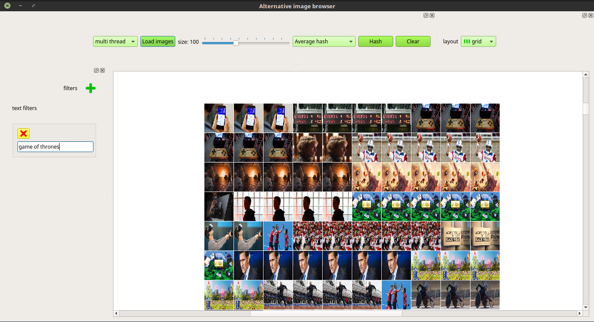
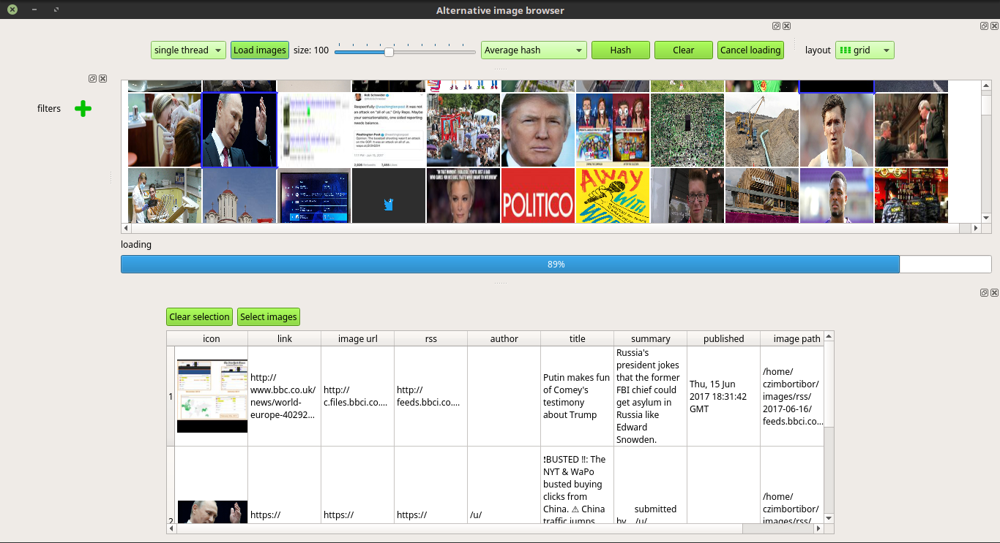
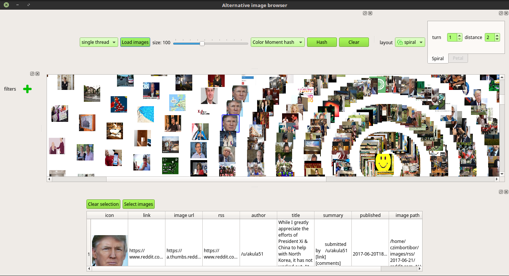
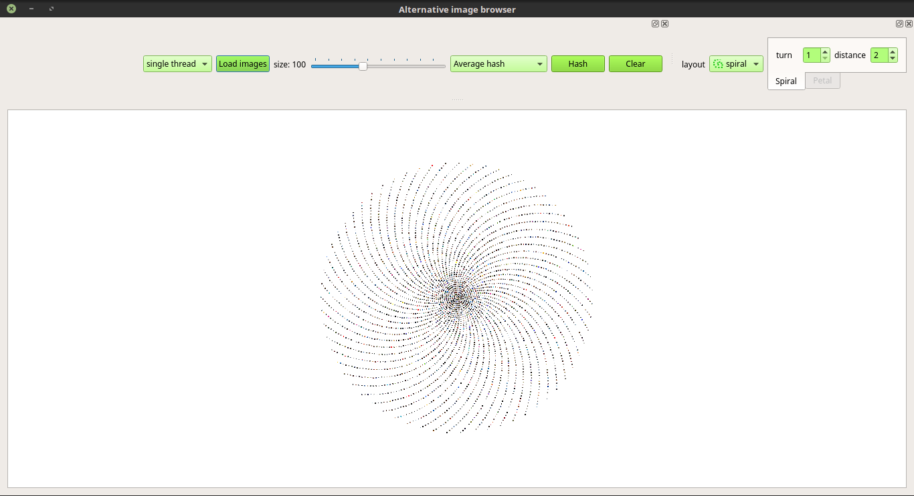
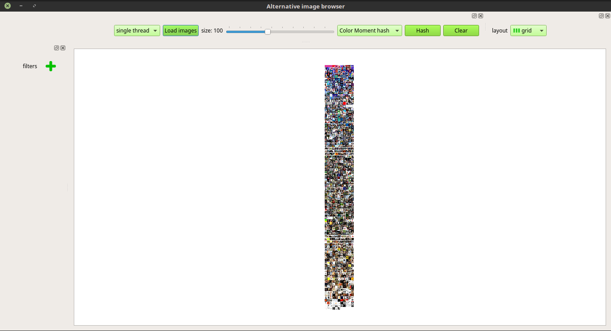
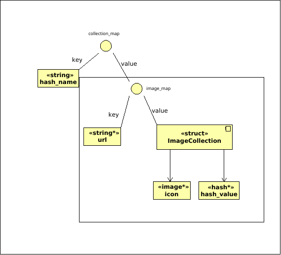

# Large annotated image collection management
Images with metadata collected from RSS feeds with a [separate tool](https://github.com/czimbortibor/rss-atom-feedscraper) and saved to MongoDB.

Upon choosing a collection, the app tries to load everything into memory, while simultaneously running multiple hashing algorithms on the images.

Images hashes calculated, each applicable for a different use case:

    - Average hash
    - Perceptual hash
    - Marr Hildreth hash
    - Radial Variance hash
    - Block Mean hash
    - Color Moment hash

### The app

Instant reordering of the collection based on a selected picture and a hashing method, different layouts (grid, petal, spiral), larger sized image load on hover tooltip, displaying metadata and search based on some of its fields.

#### Instant search and reorder

#### Metadata about the images

#### 5000+ images

### In-memory storage structure of the images

